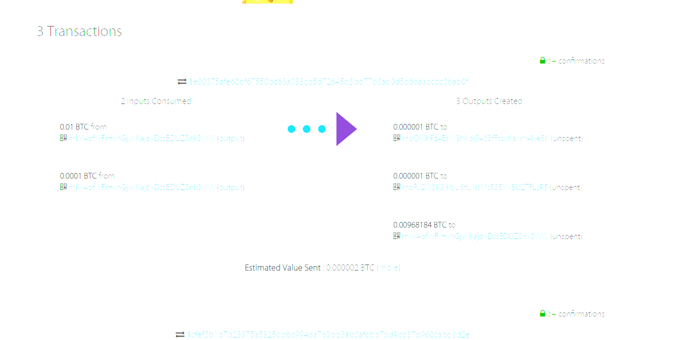
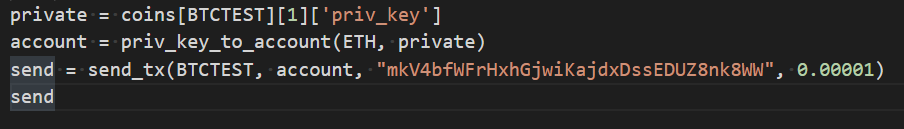

# Blockchain with python

## Bitcoin TestNet

With this wallet you can send transactions of Bitcoin Testnet and Ethereum using a few lines of code 

Was able to create this wallet programatically thanks to
the hd-wallet-derive repository which can be found [here](https://github.com/dan-da/hd-wallet-derive)

dependencies:
`pip install web3`
`pip install bit`